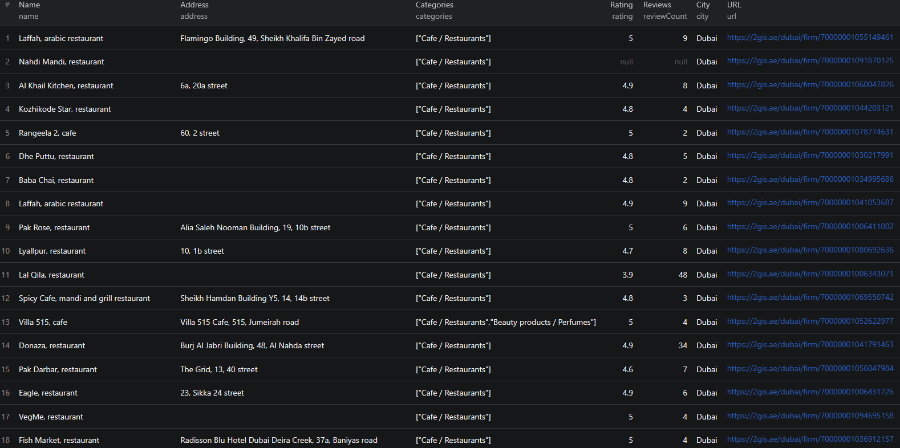

# How to Scrape 2GIS in Node.js

This example shows how to extract business listings from [2GIS](https://2gis.com) using the [Apify 2GIS Scraper](https://apify.com/piotrv1001/2gis-scraper) actor — no browser automation or HTML parsing required. The actor handles the scraping; this repo shows you how to call it from Node.js, pass input, and work with the results.



## What this example does

- Calls the `piotrv1001/2gis-scraper` Apify actor with a start URL
- Waits for the run to complete
- Fetches results from the actor's dataset
- Prints each business listing to the console

## Prerequisites

- [Node.js](https://nodejs.org/) v18 or higher
- An [Apify account](https://console.apify.com/sign-up)
- An [Apify API token](https://console.apify.com/settings/integrations)

## Installation

```bash
npm install
```

## Environment setup

Copy `.env.example` to `.env` and add your Apify API token:

```bash
cp .env.example .env
```

Then edit `.env`:

```env
APIFY_TOKEN=your_apify_token_here
```

## Usage

```bash
npm start
```

## Code example

```js
import { ApifyClient } from 'apify-client';
import 'dotenv/config';

// Initialize the ApifyClient with your Apify API token
// Set APIFY_TOKEN in your .env file (copy .env.example to get started)
const client = new ApifyClient({
    token: process.env.APIFY_TOKEN,
});

// Prepare Actor input
const input = {
    "startUrls": [
        {
            "url": "https://2gis.ae/dubai/search/restaurants"
        }
    ]
};

// Run the Actor and wait for it to finish
const run = await client.actor("piotrv1001/2gis-scraper").call(input);

// Fetch and print Actor results from the run's dataset (if any)
console.log('Results from dataset');
console.log(`💾 Check your data here: https://console.apify.com/storage/datasets/${run.defaultDatasetId}`);
const { items } = await client.dataset(run.defaultDatasetId).listItems();
items.forEach((item) => {
    console.dir(item);
});

// 📚 Want to learn more 📖? Go to → https://docs.apify.com/api/client/js/docs
```

## Example output

See [`sample-output.json`](./sample-output.json) for a full example. Each result contains:

- `id` — unique 2GIS business identifier
- `name` / `nameExtension` — business name
- `address`, `city`, `district` — location details
- `latitude` / `longitude` — GPS coordinates
- `categories` — business category list
- `rating` / `reviewCount` — user rating and review count
- `schedule` — opening hours by day of week
- `attributes` — rich metadata (cuisine type, payment methods, services, languages, accessibility, etc.)
- `photoCount` — number of photos on the listing
- `branchCount` — number of branches
- `url` — direct link to the 2GIS listing
- `searchUrl` — the search URL this result came from
- `scrapedAt` — timestamp of when the data was collected

## Use cases

- **Lead generation** — build lists of local businesses (restaurants, hotels, clinics, shops) with contact and location data
- **Market research** — analyze business density, ratings, and category distribution across cities or districts
- **Competitor analysis** — track competitor branches, ratings, and service attributes over time
- **Real estate & location intelligence** — enrich property datasets with nearby business data
- **Travel & hospitality apps** — power search features with structured POI data from 2GIS-covered regions

## Try the actor on Apify

**[Open the 2GIS Scraper on Apify](https://apify.com/piotrv1001/2gis-scraper)**

## License

MIT
