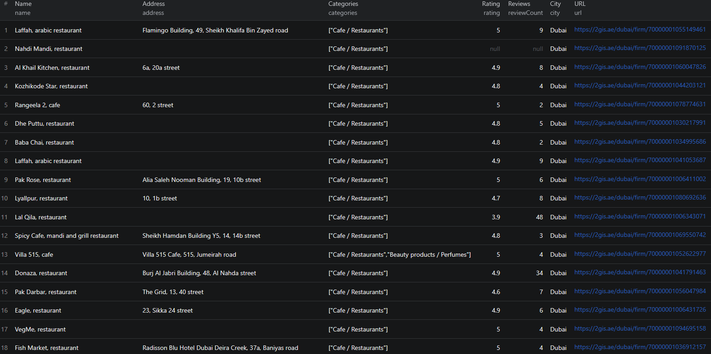

# How to Scrape 2GIS in Node.js

This example calls our [2GIS Places Scraper](https://apify.com/piotrv1001/2gis-scraper) on Apify from Node.js to build a local lead list. Give it a business type and a city, and it returns each place's address, rating and category, plus the **phones, emails, websites and WhatsApp, Telegram and Instagram links** the business lists on 2GIS. The script prints how many places have each contact type and saves an outreach sheet, `leads.csv`.

No browser automation, HTML parsing or 2GIS account needed.



## Prerequisites

- [Node.js](https://nodejs.org/) 18 or newer
- An [Apify account](https://console.apify.com/sign-up) and its [API token](https://console.apify.com/settings/integrations)

## Setup

```bash
npm install
cp .env.example .env   # then put your token in APIFY_TOKEN
```

## Usage

```bash
npm start                                      # dentists (стоматология) in Almaty, 60 places
npm start dentist dubai ae 50                  # keyword, city, 2GIS domain, max places
npm start "автосервис" tashkent uz 100
```

`city` is the slug from the city's 2GIS URL. The domain (`country`) is one of `ae`, `ru`, `kz`, `uz`, `kg`, `az`, `com.cy`. Search in the language locals use.

Output of `npm start стоматология almaty kz 24`:

```
24 places for "стоматология" in almaty
│ phone     │ 24 │
│ email     │ 9  │
│ website   │ 10 │
│ whatsapp  │ 24 │
│ telegram  │ 1  │
│ instagram │ 21 │
Saved 24 rows to leads.csv
```

`leads.csv` has one row per branch, sorted by review count, with the first phone, email, website, WhatsApp, Telegram and Instagram link in their own columns, plus `orgName` and `branchCount` so you can contact each organization once. It opens correctly in Excel, including Cyrillic and Arabic names.

## The Actor input

```js
{
    searchQueries: ['стоматология'],  // or startUrls: [{ url: 'https://2gis.kz/almaty/search/...' }]
    city: 'almaty',
    country: 'kz',
    maxItems: 60,                     // places in the whole run (default 50)
    includeContacts: true,            // default
}
```

`maxPages` (default 5, about 12 places per page) limits each search. A city that 2GIS doesn't have on that domain fails the run with a clear message instead of returning wrong places.

## Output

See [`sample-output.json`](./sample-output.json) for two full rows from a real run. Besides `phones`, `emails`, `websites` and `socials`, each place has `name`, `orgName`, `branchCount`, `address`, `city`, `district`, `latitude`/`longitude`, `categories`, `rating`, `reviewCount`, `schedule`, `attributes`, `url` and `scrapedAt`.

Contacts are what each business lists publicly on 2GIS, so coverage differs by market: in our runs WhatsApp was on almost every Almaty dental clinic, while Telegram was more common in Tashkent. Check the rules on unsolicited messages in the country you're contacting before outreach.

## Cost

Pricing as of September 28, 2026: $0.0018 per place (contacts included), plus a $0.00005 start fee per GB of run memory. The default run of 60 places costs about $0.11. Check [current pricing](https://apify.com/piotrv1001/2gis-scraper/pricing).

## Related resources

- [How to Scrape 2GIS Business Listings With Phones and Emails](https://www.falconscrape.com/blog/how-to-scrape-2gis-business-listings): the full guide, including picking the outreach channel per market and mapping a district
- [2GIS Places Scraper on Apify](https://apify.com/piotrv1001/2gis-scraper)

## License

MIT
